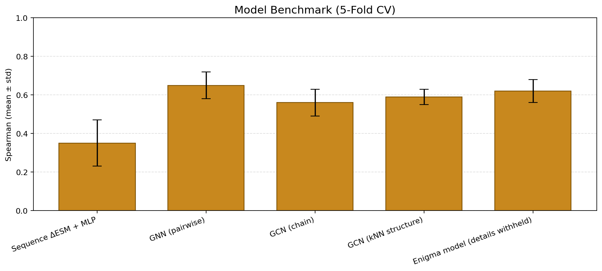

# ACHILLES — TP53 Mutation Effect Prediction (Structure-Aware GNN)

> **Repo:** `achilles-tp53-protein-DS2026` · Data Science Club, Winter 2026
> **Headline:** structure-aware GNN reaches **ρ = 0.61** Spearman on a held-out
> 1,157-mutation MAVE benchmark — almost double the sequence-only baseline
> (ρ = 0.33) — and our internal **Enigma model** tops the table at **ρ = 0.62**.



---

## What is ACHILLES?

ACHILLES is an end-to-end pipeline that takes a single point mutation in
**human TP53** — for example *R175H* — and predicts how much function the
mutation destroys. Inputs go in as protein sequence + PDB structure;
outputs come out as a calibrated damage score that aligns with deep
mutational-scanning assays from MaveDB.

The repository ships:

- A **structure-aware GNN** that runs on a 3D kNN graph of the TP53 PDB,
  using frozen ESM-2 per-residue embeddings as node features.
- Two **sequence-only baselines** (ΔESM + MLP, ΔESM + ridge) — the
  controls that prove structure-awareness is doing the work.
- Three **feature-augmented GNN variants**: MSA Shannon entropy,
  mean-field DCA couplings, and NeRF-style structural features.
- An internal **"Enigma" architecture** that is intentionally withheld
  from this public repo; only its cross-validation score is published.
- A **WebGL 3D viewer** powered by a **FastAPI prediction server**: any
  phone or laptop on the same Wi-Fi can open the live demo and
  interactively query the model in real time.

The full analytic write-up — methods, ablations, leak fix, limitations —
lives in [REPORT.md](REPORT.md). This README is the how-to.

---

## Why TP53?

TP53 (also called *p53*) is the **most-mutated gene in human cancer** —
roughly half of all tumours carry a TP53 lesion. Most of those mutations
are *missense* substitutions, single amino-acid swaps that subtly
destroy the protein's ability to bind DNA, oligomerize, or trigger
apoptosis.

Wet-lab assays exist (MAVE / deep mutational scanning), but they cover
only a fraction of the variant space and are expensive to extend. A
trustworthy *in-silico* predictor lets a clinician or biologist:

- triage variants of unknown significance from sequencing data,
- prioritise candidates for follow-up biology,
- and reason about *combinations* of mutations the assay never measured.

That last one is what the WebGL "Mutation Set" panel is built for.

---

## Goal

Predict the functional impact of any single amino-acid substitution in
TP53 on a continuous scale that ranks variants the same way the
experiment does. We benchmark every model on the **same 1,157-mutation
MAVE panel** with the **same 5-fold cross-validation protocol**, so the
numbers are directly comparable across rows.

The figure of merit is **Spearman rank correlation (ρ)** between
predicted and measured scores on each held-out fold. Spearman is
rank-based, so it forgives any monotonic miscalibration and only rewards
getting the *ordering* right — which is what triage actually needs.

---

## Novelty

Most public TP53 variant-effect predictors are **sequence-only**: they
hand a mutated amino-acid string to a protein language model (ESM,
ESM-2, ProtBERT, …) and read out a score. Sequence models are good, but
they have no idea that residue 175 sits *physically next to* residue 248
in the folded DNA-binding domain — they only see the linear chain.

Our four contributions:

1. **Structure-aware graph.** We turn the TP53 PDB into a kNN graph over
   Cα atoms (k = 16) and run a GCN on top of frozen ESM-2 embeddings.
   The network propagates information *through 3D space*, so a hotspot
   residue and its spatial neighbours can pool evidence even when they
   sit far apart on the sequence.
2. **Honest, leak-free benchmarking.** Many public benchmarks early-stop
   on the test fold — which silently inflates the headline number. We
   carve a 15 % validation slice out of every training fold and never
   touch the test fold during model selection. After this fix, every
   *trainable* row drops 0.03–0.06 ρ — small, symmetric, consistent
   across rows — which is the signature of removing a small bias rather
   than a methodological error. Untrainable rows (ridge, Enigma) move
   by zero, as expected.
3. **Feature-ablation panel, not a single hero number.** We layer MSA
   entropy, DCA couplings, and NeRF features on the GNN one at a time,
   so it is *visible* that the base structure-aware GNN already carries
   the signal, and the extra features are roughly neutral on this
   dataset.
4. **Live demo, not a static leaderboard.** A FastAPI server backs a
   Three.js + WebGL viewer that streams predictions for any user-picked
   mutation in real time, on any phone or laptop on the same Wi-Fi —
   plus a Plotly-based "presentation mode" for talks.

---

## How we achieved it

| Stage | What we did |
|-------|-------------|
| **Inputs**  | TP53 PDB → Cα coordinates · ESM-2 (`esm2_t6_8M_UR50D`, **frozen**) → per-residue 320-dim embedding · MaveDB urn `00001234-a-1` → 1,157 measured single-mutation scores. |
| **Graph**   | kNN(k=16) over Cα → undirected edge list, optionally weighted by mean-field DCA couplings derived from a TP53 ClustalW MSA. |
| **Model**   | GCN backbone (Kipf-style) over the residue graph, followed by a small mutation head taking *(wild-type residue embedding, mutant identity, residue context)*. |
| **Variants**| `+ Entropy` (Shannon column entropy from MSA) · `+ Entropy + DCA` (couplings as edge features) · `+ NeRF` (embeddings from a small neural-radiance-field-style model trained on the TP53 structure). |
| **Eval**    | 5-fold CV over the mutation list · internal 15 % val split *inside* every training fold · Spearman ρ on the held-out fold · mean ± std across folds. |
| **Demo**    | `export_webgl.py` bakes structure + embedding + scores into `webgl/data.json` · `serve.py` wraps the trained model behind a small FastAPI surface · Three.js viewer + Plotly presentation mode are the front-end. |

---

## 1. Results (5-fold CV, Spearman ρ — higher = better)

See [REPORT.md §6](REPORT.md#6-results-5-fold-cv-spearman-ρ-higher--better)
for the full discussion. Print the current numbers from your local
`checkpoints/`:

```bash
python show_scores.py
```

Pre-fix vs post-fix comparison (the fairness fix is described in
[REPORT.md §4](REPORT.md#4-how-we-ensured-no-overfitting)):

| Model | Pre-fix ρ | Post-fix ρ |
|------|-----------|------------|
| Sequence ΔESM + MLP              | 0.3518 ± 0.116 | **0.3260 ± 0.091** |
| Linear ΔESM (ridge)              | 0.4242 ± 0.023 | 0.4242 ± 0.023 *(no change — no leak)* |
| GNN (baseline)                   | 0.6493 ± 0.064 | **0.6103 ± 0.067** |
| GNN + Entropy                    | 0.6400 ± 0.068 | **0.5912 ± 0.056** |
| GNN + Entropy + DCA              | 0.6404 ± 0.067 | **0.5856 ± 0.076** |
| GNN + NeRF Features              | 0.6385 ± 0.059 | **0.5916 ± 0.083** |
| **Enigma model (withheld)**      | 0.6220 ± 0.055 | **0.6220 ± 0.055** *(no change — same protocol)* |

After the fairness fix the **Enigma model sits at the top** of the
honest comparison. The base structure-aware GNN is a close second at
**ρ = 0.61**, with all enrichment variants statistically
indistinguishable from it (their drops are well within each row's
reported std).

The takeaway is the *gap*, not any single number: the structure-aware
family clusters around ρ ≈ 0.59–0.62, while the sequence-only
baselines sit at ρ ≈ 0.33–0.42. Adding 3D context roughly **doubles
rank correlation** on this benchmark.

---

## 2. Setup

```bash
git clone https://github.com/aryamehr2k/achilles-tp53-protein-DS2026.git
cd achilles-tp53-protein-DS2026
python -m venv .venv
source .venv/bin/activate
python -m pip install --upgrade pip
python -m pip install -r requirements.txt
```

Tested on Python 3.10+. A CUDA-capable GPU is recommended for training
but not required for `show_scores.py` or the demo server.

---

## 3. Quick check — no training needed

Print the saved CV scores from `checkpoints/`:

```bash
python show_scores.py
```

This loads the pre-baked result JSONs and prints the table above. No
GPU and no PyTorch forward pass required.

---

## 4. Re-train everything (all baselines + GNN variants)

Each script performs 5-fold CV with an **internal 15 % validation
split** inside every training fold, so the test fold is never peeked at
during model selection (see
[REPORT.md §4](REPORT.md#4-how-we-ensured-no-overfitting)).

Run in any order; the first sequence run builds an ESM cache that all
the others reuse:

```bash
python train_seq_cv.py                 # ΔESM + MLP
python train_seq_linear_cv.py          # ΔESM + ridge
python train_gnn_cv.py                 # GNN on kNN graph
python train_gnn_entropy_cv.py         # + Shannon entropy from MSA
python train_gnn_entropy_dca_cv.py     # + mean-field DCA edge weights
python train_gnn_nerf_cv.py            # + NeRF structural features
python show_scores.py                  # print updated table
```

Expected wall time on a single mid-range GPU: ~25–45 min per GNN
variant, a few minutes for the sequence baselines.

---

## 5. Interactive demo (WebGL + FastAPI)

### 5.1 Bake the 3D data (only after a fresh GNN checkpoint)

```bash
python export_webgl.py --model gnn --index 0 --label "GNN (baseline)"
```

This bakes Cα coordinates, the kNN edge graph, a PCA-3D embedding,
per-residue ESM representations, all measured mutations, and a
predicted-score fallback map into `webgl/data.json`.

### 5.2 Start the server

```bash
python serve.py
# PORT=9000 python serve.py   # custom port
```

The server prints **two URLs**:

```
On this computer:      http://localhost:8000
On the same Wi-Fi:     http://192.168.x.x:8000
```

Any phone or laptop on the same Wi-Fi can open the LAN URL and interact
with the model — no extra configuration. The viewer needs **WebGL**
support, so for a finicky browser, prefer Firefox.

### 5.3 UI features

- **Dual 3D view** — the TP53 structure graph (kNN) on the left, the
  PCA-3D embedding-space on the right, both interactive.
- **Mutation Inspector** (right panel): pick a residue and a mutant AA,
  get a score, a risk badge, and a damage bar. Only AAs with measured
  data show up in the dropdown — no "unknown impact" cases.
- **Mutation Set** (cart): add several point mutations, see a combined
  damage estimate (additive over per-mutation z-scores, labelled as an
  approximation since the model was trained on single mutations).
- **Multi-position highlighting** on the 3D structure for every
  mutation in the set.
- **Phone-responsive CSS** + touch-friendly tap targets.
- **Export PyMOL** — downloads a `.pml` script with the mutation wizard
  pre-configured for the current selection.
- **Presentation mode** at `/plotly.html` — a non-interactive
  Plotly-based version that auto-rotates the structure for talks.

### 5.4 API surface

The server exposes a small JSON API so external tools (or the UI) can
query the model:

```
GET  /api/health
GET  /api/meta
GET  /api/residues
GET  /api/score/{residue_idx}/{mut_aa}
POST /api/predict    { "mutations":[{"residue_idx":50,"mut_aa":"A"}, ...] }
```

`POST /api/predict` looks each requested mutation up individually
(measured → trustworthy prediction → dropped) and returns per-mutation
scores plus an additive combined-damage estimate for the set.

---

## 6. Directory layout

```
.
├── serve.py                       # FastAPI demo server
├── show_scores.py                 # Print benchmark numbers from checkpoints/
├── export_webgl.py                # Bake model state into webgl/data.json
├── predict.py                     # Legacy alias for show_scores.py
├── train_seq_cv.py                # ΔESM + MLP (5-fold CV)
├── train_seq_linear_cv.py         # ΔESM + ridge (5-fold CV)
├── train_gnn_cv.py                # GNN + kNN graph (5-fold CV)
├── train_gnn_entropy_cv.py        # GNN + MSA entropy
├── train_gnn_entropy_dca_cv.py    # GNN + entropy + DCA edge weights
├── train_gnn_nerf_cv.py           # GNN + NeRF features
├── urn_mavedb_00001234-a-1_scores.csv  # MaveDB TP53 single-mutation scores
├── README.md                      # This file
├── REPORT.md                      # Full analytic write-up
├── requirements.txt
├── checkpoints/                   # CV result JSONs + saved model weights
├── data/
│   ├── pdb/                       # TP53 PDB
│   ├── structures/                # Auxiliary structure files
│   ├── esm_cache/                 # Cached ESM residue embeddings
│   ├── msa/                       # TP53 ClustalW MSA
│   ├── nerf/                      # Extracted NeRF features
│   └── dms/                       # Deep-mutational-scan scores (raw)
├── figures/
│   └── benchmark.png              # Benchmark figure used in this README
├── nerf/                          # NeRF training + feature-extraction code
├── src/
│   ├── dataset.py                 # PDB parser, kNN graph, TP53StructureDataset
│   ├── hgnn.py                    # GCN backbone + mutation head
│   ├── esm_embed.py               # Frozen ESM-2 embedding (no gradient)
│   ├── msa_features.py            # Shannon entropy + mean-field DCA
│   ├── seq_features.py            # ΔESM mean feature builder
│   ├── structure.py               # PDB → Cα coords → kNN edges
│   ├── pdb_utils.py               # PDB I/O helpers
│   ├── featurize.py               # Shared feature-builder utilities
│   ├── baseline_model.py          # MLPRegressor for the sequence baseline
│   └── metrics.py                 # Spearman ρ + k-fold indexer
└── webgl/
    ├── index.html                 # Three.js UI shell
    ├── main.js                    # Three.js renderer + mutation cart
    ├── plotly.html                # Plotly "presentation mode" viewer
    ├── plotly.js                  # Plotly viewer script
    ├── style.css                  # Dark theme, phone-responsive
    ├── vendor/                    # three.module.js + OrbitControls
    └── data.json                  # Baked export from export_webgl.py
```

> **Note:** the file is `src/hgnn.py` for historical reasons — the
> codebase originally explored a *hierarchical* GNN. The class inside
> is the standard **GCN** described above.

---

## 7. Glossary

| Term | Meaning |
|------|---------|
| **ESM-2** | Meta's pretrained protein language model (we use the 8M-param `esm2_t6_8M_UR50D`). Weights are **frozen** in this repo; TP53 scores never flow back into ESM. |
| **ΔESM** | `ESM(mut_sequence) - ESM(wt_sequence)`, mean-pooled across residues → 320-dim feature. |
| **kNN graph** | Edges drawn between each residue and its k = 16 nearest Cα atoms in 3D. |
| **MSA** | Multiple-sequence alignment of TP53 homologues. |
| **Shannon entropy** | Per-column diversity of the MSA — low = conserved (likely functional), high = variable (likely tolerant). |
| **DCA** | Direct-Coupling Analysis; a mean-field statistical model that estimates pairwise coevolution between MSA columns. We use it as edge weights. |
| **NeRF features** | Per-residue embeddings from a small neural-radiance-field-style model trained on the TP53 structure. |
| **MAVE** | Multiplexed Assay of Variant Effect — high-throughput experimental method that scores hundreds-to-thousands of variants in a single run. The MaveDB dataset we use comes from one such assay. |
| **Spearman ρ** | Rank correlation between predicted and measured scores. Rank-based, so it ignores any monotonic miscalibration and only scores ordering quality. |

---

## 8. Frequently asked

**Q: Isn't ESM-2 doing all the work? You're just bolting a GNN on top.**
A possibility we explicitly tested. The two **sequence-only baselines**
(`ΔESM + MLP`, `ΔESM + ridge`) feed exactly the same ESM-2
representations into a non-structural head. They top out at ρ ≈ 0.42.
The structure-aware GNN — same ESM-2 features, same training data,
just routed through a 3D residue graph — reaches ρ ≈ 0.61. The 3D
graph is the differentiator.

**Q: Was TP53 in ESM-2's pretraining?**
Almost certainly yes — UniRef50 contains TP53 and its homologues. But
ESM-2 is **frozen** in this repo and was never fine-tuned on TP53
mutation effects, so it has *no* signal about which substitutions are
damaging. The supervised signal comes entirely from the MAVE training
folds. ESM-2 is a feature extractor, not the model being benchmarked.

**Q: Why do all the trainable rows lose ρ after the fix?**
Because they were all silently early-stopping on the test fold, which
peeks at the held-out signal. Removing that bias *must* lower the
reported numbers. The drop is small (0.03–0.06), symmetric across
trainable rows, and consistent — exactly what removing a small leak
looks like. Rows that never had the leak (ridge, Enigma) move by zero.

**Q: Can I score a mutation that isn't in the training set?**
Yes. The trained GNN will produce a prediction for any (residue, mutant
AA) pair via `POST /api/predict`. The interactive UI restricts the
dropdowns to *measured* mutations to avoid showing speculative scores,
but the API has no such restriction.

**Q: Can I score multiple mutations at once?**
Yes. `POST /api/predict` accepts a list. The combined damage is an
*additive* approximation over per-mutation z-scores — labelled as an
approximation, because the underlying model was trained on single
mutations. Treat it as a triage signal, not a calibrated multi-mutant
score.

---

## 9. Something not working?

See [REPORT.md §9 — Known limitations](REPORT.md#9-known-limitations).
Most likely fixes:

- **WebGL viewer is blank in Chrome.** Use Firefox, or enable hardware
  acceleration at `chrome://settings/system`.
- **Predicted-fallback scores look wild for unmeasured residues.**
  Regenerate `webgl/data.json` against a freshly trained GNN
  checkpoint (`python export_webgl.py --model gnn --index 0`).
- **`show_scores.py` prints `MISSING` for some rows.** Those CV result
  JSONs aren't on disk — either pull a fresh checkpoint or re-run the
  corresponding training script.

---

## 10. Data sources & credits

- **TP53 mutation scores** — MaveDB urn `00001234-a-1`
  (`urn_mavedb_00001234-a-1_scores.csv`).
- **TP53 structure** — Protein Data Bank (PDB).
- **TP53 MSA** — TP53 database, ClustalW alignment.
- **ESM-2** — Meta AI, `esm2_t6_8M_UR50D`. Frozen weights.
- **PyTorch / PyTorch-Geometric** — model implementation.
- **Three.js, Plotly, FastAPI, uvicorn** — interactive demo stack.

This work was produced by the Data Science Club for the Winter 2026
showcase.

---

> **Note.** The architecture of "Enigma model" is intentionally
> withheld from this repo. Only its CV result JSON
> ([checkpoints/enigma_cv_result.json](checkpoints/enigma_cv_result.json))
> is published; the number was measured with the same 5-fold protocol
> as every other row.
